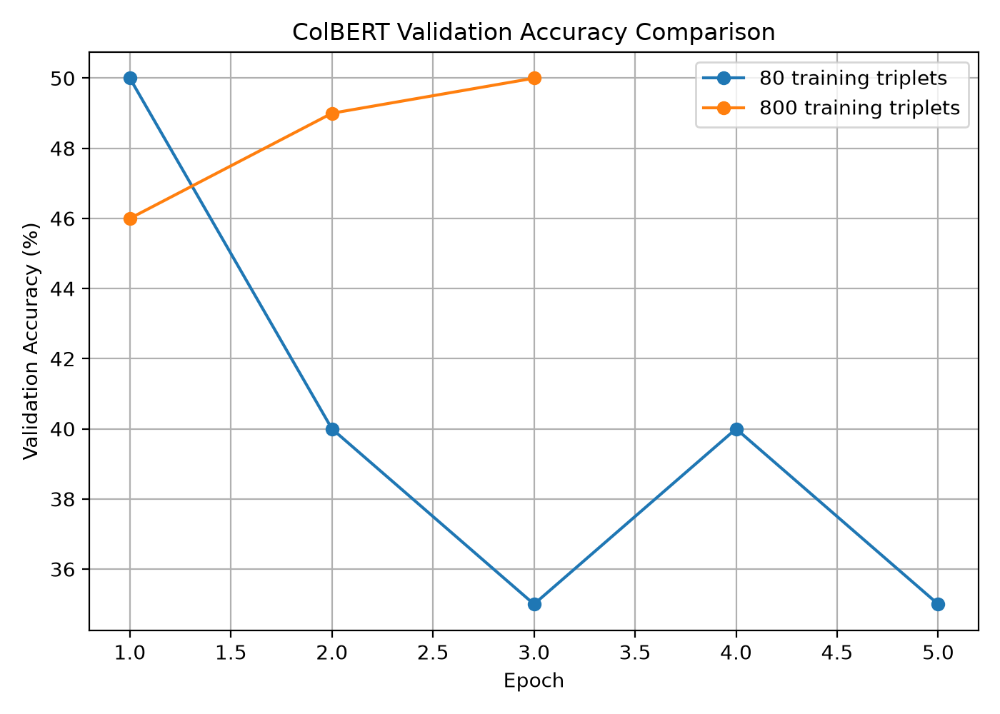

# ColBERT: Late Interaction Retrieval — Small-Scale Replication

A from-scratch educational replication of core ideas from **ColBERT: Efficient and Effective Passage Search via Contextualized Late Interaction over BERT**.

This project implements token-level BERT representations, dimensionality reduction, L2 normalization, ColBERT-style query/document markers, MaxSim late interaction, MS MARCO triplet training, document indexing, checkpoint persistence, and retrieval evaluation.

> This is a small-scale replication designed to study ColBERT's architecture and training behavior. It is **not** a reproduction of the full MS MARCO benchmark results reported in the original paper.

---

## Core Idea

Unlike bi-encoders that compress each query and document into one vector, ColBERT retains token-level representations.

For every query token, the model finds the most similar document token using maximum similarity.

The final relevance score is the sum of these token-level maximum similarities.

```text
Query tokens
     ↓
BERT + projection + L2 normalization
     ↓
Q1 Q2 Q3 ... Qm
     │
     │ token-level similarities
     ↓
D1 D2 D3 ... Dn
     ↓
MaxSim per query token
     ↓
Sum
     ↓
Relevance score
```

---

## Features

* BERT-based token encoder
* 768 → 128 dimensional projection
* L2-normalized token embeddings
* `[Q]` query marker
* `[D]` document marker
* ColBERT MaxSim late interaction
* Pairwise ranking loss
* In-batch cross-entropy loss implementation
* MS MARCO triplet dataset loading
* Train/validation separation
* Frozen-BERT experiments
* Partial BERT fine-tuning experiment
* Document indexing
* Saved index persistence
* Saved model checkpoints
* MRR evaluation
* Recall@K evaluation
* Unit tests with PyTest

---

## Architecture

```text
                     QUERY
                       │
                      [Q]
                       │
                    BERT
                       │
                 Linear 768→128
                       │
                L2 Normalize
                       │
              Query token vectors
                       │
                       │
                     MaxSim
                       │
                       │
            Document token vectors
                       │
                L2 Normalize
                       │
                 Linear 768→128
                       │
                    BERT
                       │
                      [D]
                       │
                   DOCUMENT
```

---

## Dataset

Experiments use triplets sampled from the **MS MARCO passage-ranking dataset**:

```text
(query, positive passage, negative passage)
```

The main experiment uses:

```text
1,000 triplets
├── 800 training examples
└── 200 validation examples
```

The validation examples are not used for gradient updates.

---

## Training Experiments

### Experiment 1 — Tiny MS MARCO subset

Training examples: 80
Validation examples: 20
BERT: Frozen
Projection dimension: 128

The model strongly overfit the small training set.

Training loss fell from approximately:

```text
0.762 → 0.089
```

while validation accuracy remained between approximately 35–50%.

This demonstrated that the tiny dataset was insufficient for reliable generalization.

---

### Experiment 2 — 800/200 MS MARCO split

Training examples: 800
Validation examples: 200
BERT: Frozen
Projection dimension: 128

| Epoch | Training Loss | Validation Accuracy | Validation Margin |
| ----: | ------------: | ------------------: | ----------------: |
|     1 |        0.7169 |                 46% |           -0.0113 |
|     2 |        0.6373 |                 49% |           -0.0084 |
|     3 |        0.5141 |                 50% |           +0.0210 |

Increasing the amount of training data reduced overfitting and produced more stable validation behavior.

---

### Experiment 3 — `[Q]` / `[D]` markers

ColBERT-style query and document markers were added to distinguish query encoding from document encoding.

| Epoch | Training Loss | Validation Accuracy | Validation Margin |
| ----: | ------------: | ------------------: | ----------------: |
|     1 |        0.7203 |               44.5% |           -0.0098 |
|     2 |        0.6225 |           **52.0%** |           +0.0032 |
|     3 |        0.4913 |               51.0% |           -0.0037 |

The best validation accuracy increased from 50% to **52%**.

---

### Experiment 4 — Partial BERT Fine-Tuning

The final BERT transformer layer and projection layer were fine-tuned while earlier BERT layers remained frozen.

| Epoch | Training Loss | Validation Accuracy | Validation Margin |
| ----: | ------------: | ------------------: | ----------------: |
|     1 |        0.7556 |               45.5% |           -0.0401 |
|     2 |        0.7120 |               45.5% |           -0.0274 |
|     3 |        0.6900 |               47.0% |           -0.0224 |

Under this small CPU-constrained setup, partial fine-tuning did not outperform the frozen-BERT `[Q]/[D]` configuration.

---

## Retrieval Evaluation

The best `[Q]/[D]` checkpoint was evaluated on a small ranking task containing:

```text
20 unseen queries
20 candidate positive passages
```

Each query's relevant passage was ranked against the other candidate passages.

### Results

| Metric   |      Score |
| -------- | ---------: |
| MRR      | **0.7627** |
| Recall@1 | **0.6500** |
| Recall@3 | **0.8500** |
| Recall@5 | **0.8500** |

The relevant passage appeared at rank 1 for 65% of queries and within the top 3 for 85% of queries in this small evaluation pool.

These numbers should not be compared directly with official MS MARCO benchmark results because the candidate pool and training scale are much smaller.

---

## Training Curves

Training and validation plots are stored under:

```text
results/
├── training_loss.csv
├── training_loss.png
├── training_loss_comparison.png
├── training_comparison.png
├── msmarco_split_metrics.csv
├── msmarco_800_200_metrics.csv
├── msmarco_qd_800_200_metrics.csv
├── msmarco_partial_bert_metrics.csv
└── ranking_metrics.csv
```

Example:

```markdown

```


---

## Project Structure

```text
colbert-replication/
│
├── data/
│   ├── msmarco_train_100.jsonl
│   └── msmarco_train_1000.jsonl
│
├── experiments/
│   ├── build_index.py
│   ├── evaluate_ranking.py
│   ├── evaluate_retrieval.py
│   ├── plot_comparison.py
│   ├── plot_training_loss.py
│   ├── retrieve_saved.py
│   ├── search_index.py
│   ├── search_saved_index.py
│   ├── train_inbatch.py
│   ├── train_msmarco.py
│   ├── train_msmarco_1000.py
│   ├── train_msmarco_partial_bert.py
│   ├── train_msmarco_qd.py
│   └── train_msmarco_split.py
│
├── results/
│   ├── ranking_metrics.csv
│   ├── training_comparison.png
│   └── training_loss_comparison.png
│
├── src/
│   ├── batch_loss.py
│   ├── colbert_model.py
│   ├── colbert_scorer.py
│   ├── data.py
│   ├── encoder.py
│   ├── indexer.py
│   ├── loss.py
│   ├── maxsim.py
│   ├── metrics.py
│   └── text_encoder.py
│
├── tests/
│   └── ...
│
├── requirements.txt
└── README.md
```

---

## Installation

Clone the repository:

```bash
git clone <your-repository-url>
cd colbert-replication
```

Create a virtual environment:

```bash
python -m venv .venv
```

Activate it on Windows:

```powershell
.venv\Scripts\Activate.ps1
```

Install dependencies:

```bash
pip install -r requirements.txt
```

---

## Run Tests

```bash
python -m pytest -v
```

The test suite covers MaxSim scoring, projection dimensions, normalization, ColBERT scoring, losses, indexing, index persistence, metrics, and dataset loading.

---

## Train

For the main frozen-BERT `[Q]/[D]` experiment:

```bash
python -m experiments.train_msmarco_qd
```

---

## Evaluate Ranking

```bash
python -m experiments.evaluate_ranking
```

Example output:

```text
MRR:      0.7627
Recall@1: 0.6500
Recall@3: 0.8500
Recall@5: 0.8500
```

---

## Key Findings

The experiments demonstrate several useful behaviors.

Training only a small projection layer on 80 triplets resulted in severe overfitting. Increasing training data to 800 examples improved generalization and stabilized validation performance.

Adding separate `[Q]` and `[D]` markers produced the best validation accuracy observed in the experiments.

Fine-tuning only the final BERT layer did not improve performance under the small CPU-constrained setup.

Most importantly, the late-interaction model successfully retrieved relevant passages in a multi-document ranking setting, reaching **MRR 0.7627 and Recall@3 0.85** on the small held-out evaluation pool.

---

## Limitations

This project intentionally operates at a much smaller scale than the original ColBERT work.

Major limitations include:

* only 800 training triplets in the main experiment
* CPU-only local training
* mostly frozen BERT parameters
* small retrieval candidate pool
* no full MS MARCO corpus indexing
* no official MS MARCO dev evaluation
* no approximate nearest-neighbor retrieval stage
* no distributed training
* no comparison against BM25 or dense-retrieval baselines

Therefore, the reported metrics are useful for validating the implementation, but they are **not official ColBERT/MS MARCO benchmark results**.

---

## Future Work

Potential extensions include:

* train on substantially more MS MARCO triplets
* fine-tune the full encoder on GPU
* implement ColBERT query augmentation/masking more faithfully
* build a large-scale passage index
* add approximate nearest-neighbor candidate generation
* evaluate on official MS MARCO queries and qrels
* compare against BM25 and dense bi-encoder baselines
* measure indexing latency and query latency
* measure index storage requirements
* reproduce additional ColBERT ablations

---

## Reference

Omar Khattab and Matei Zaharia.

**ColBERT: Efficient and Effective Passage Search via Contextualized Late Interaction over BERT**

SIGIR 2020.
